## Implementation Walkthrough

### 1. Azure Resource Group and Infrastructure Setup

The project began by creating a dedicated Azure resource group to organize all networking and compute resources for Northwind Logistics Ltd.

The environment included an Azure Virtual Network, VPN Gateway, and a Linux virtual machine that would later be accessed securely through a private connection.

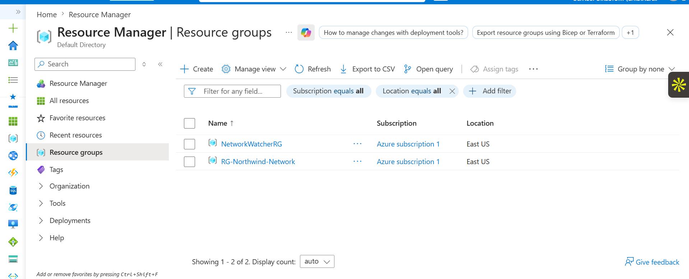

---

### 2. Virtual Network Design

A hub-based network design was created to provide centralized connectivity for remote administrators.

The virtual network was configured with separate subnets, including a dedicated Gateway Subnet required by Azure VPN Gateway.

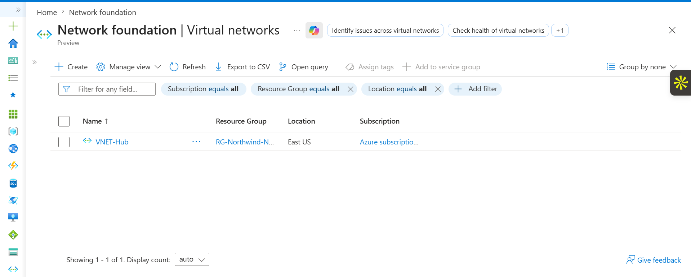

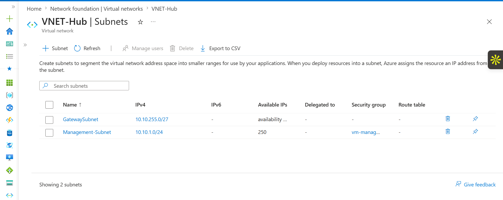

---

### 3. Azure VPN Gateway Deployment

An Azure VPN Gateway was deployed to provide secure remote access into the Azure environment.

The gateway acts as the entry point for administrators connecting from external locations through a Point-to-Site VPN connection.

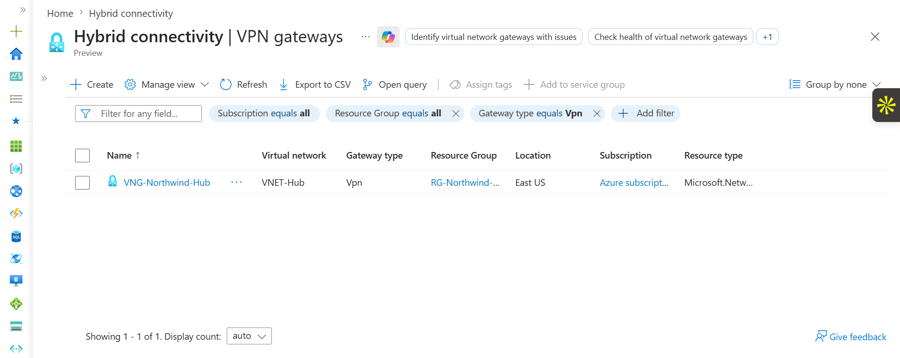

---

### 4. Point-to-Site VPN Configuration

The Point-to-Site VPN was configured to allow individual administrators and IT engineers to securely connect to Azure from remote locations.

Certificate-based authentication was selected to provide secure identity verification for VPN users.

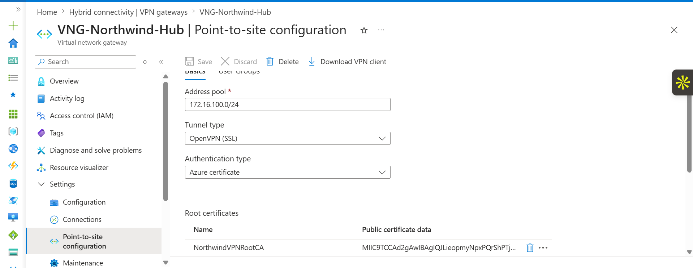

---

### 5. Certificate Authentication Setup

Self-signed certificates were generated and configured to authenticate VPN clients.

The client certificate was installed on the administrator workstation and linked to the Azure VPN Gateway authentication configuration.

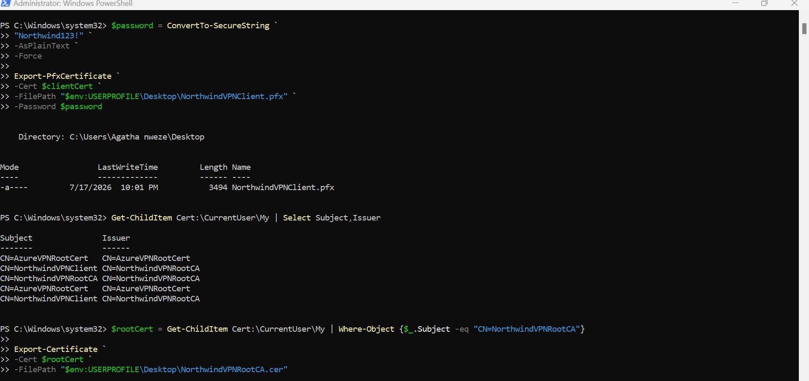

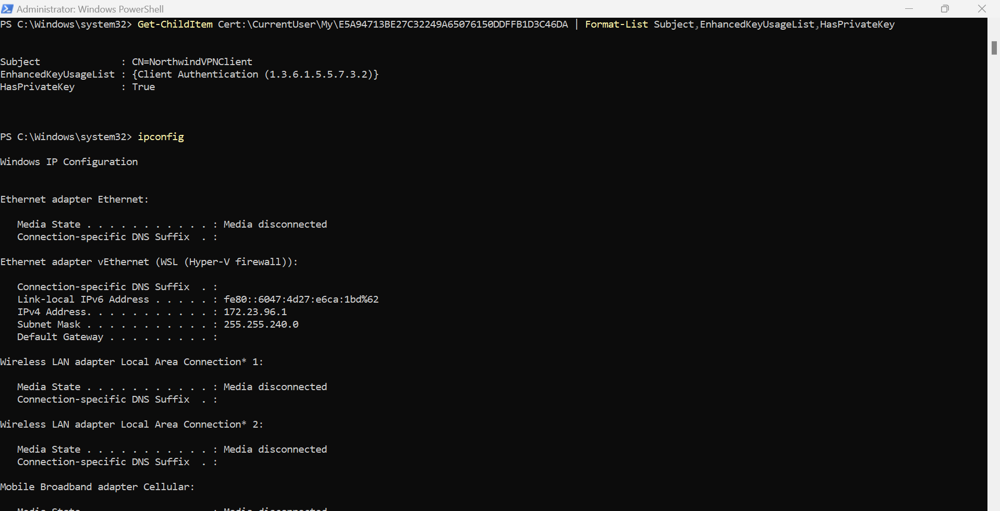

---

### 6. Establishing Secure VPN Connectivity

The Azure VPN Client was configured using the generated VPN profile.

After successful authentication, the administrator workstation received a VPN address and established secure connectivity into the Azure virtual network.

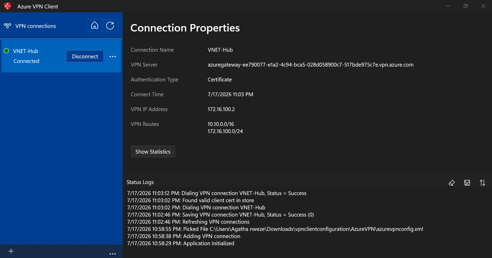

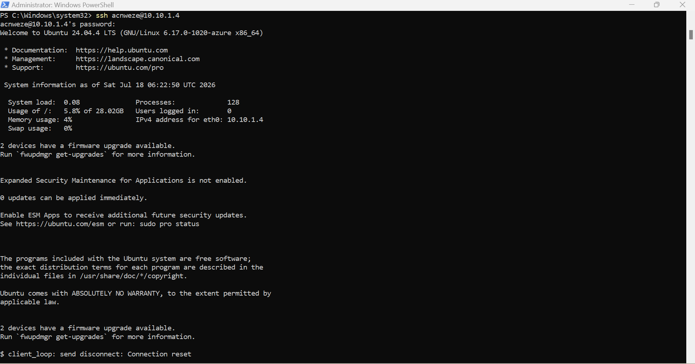

---

### 7. Testing Private Network Access

After connecting through the VPN, the virtual machine was accessed using its private IP address instead of exposing SSH directly to the public internet.

Connectivity was verified by testing communication with the VM's private address.

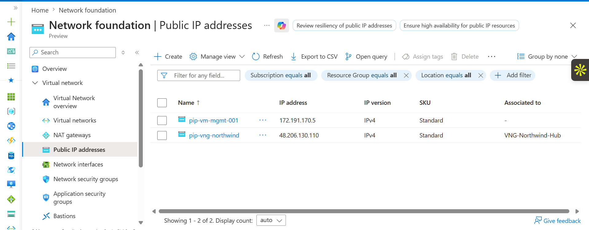

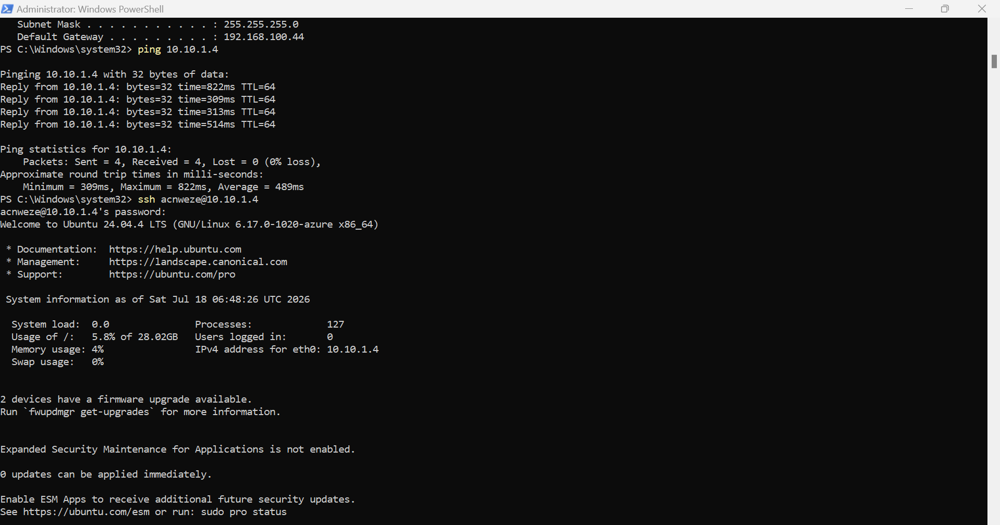

---

### 8. Secure SSH Administration

Remote administration was performed through the VPN tunnel using SSH.

The Linux virtual machine was accessed securely through its private IP address, demonstrating that administrators could manage Azure resources without public exposure.

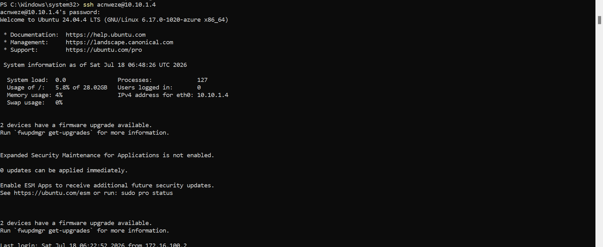

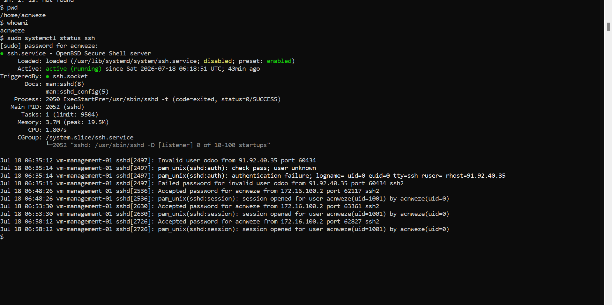

---

### 9. SSH Security Hardening

To improve security, SSH key authentication was configured and password-based authentication was removed.

This reduced the risk of brute-force attacks and ensured that only authorized administrators with approved SSH keys could access the server.

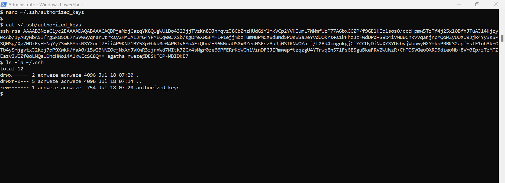

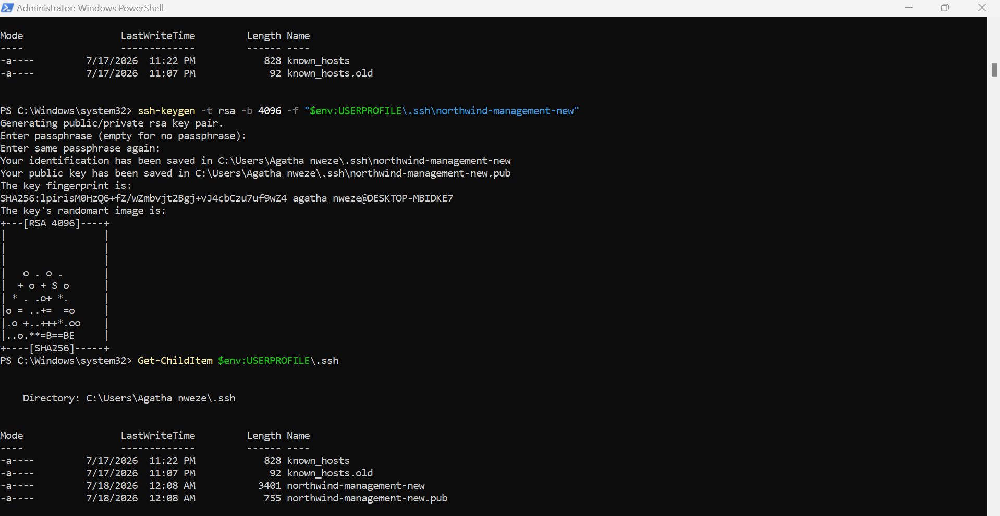

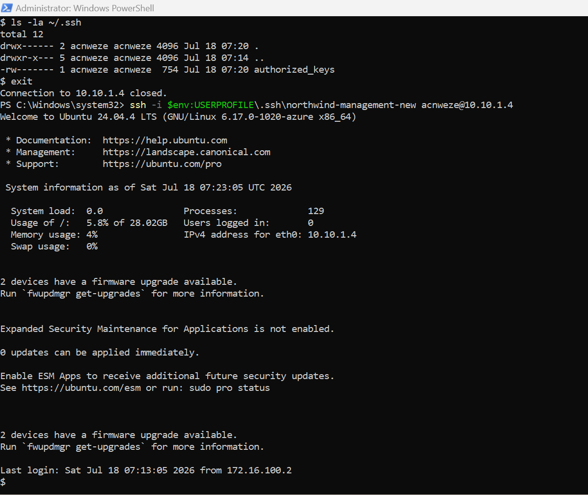
