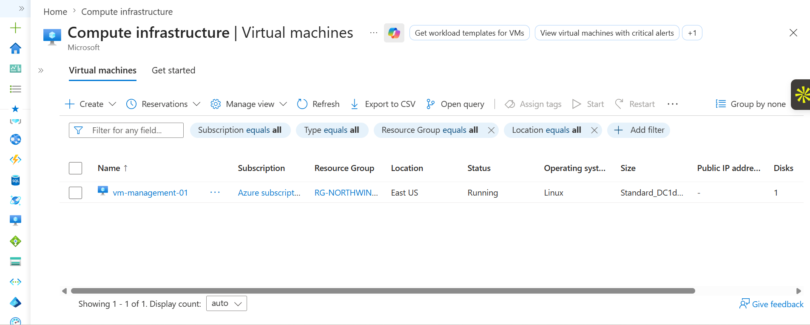

## Implementation Screenshots

### 1. Azure Resource Deployment

Created the Azure resource group and deployed the required networking resources.

### 2. Virtual Network Configuration

Configured the Azure Virtual Network and subnet structure.

### 3. Azure VPN Gateway Deployment

Configured the VPN Gateway for secure remote connectivity.

### 4. Point-to-Site VPN Configuration

Configured Point-to-Site VPN settings for remote administrators.

### 5. Certificate-Based Authentication

Created and configured certificates for VPN authentication.

### 6. Azure VPN Client Connection

Connected the administrator workstation to Azure using the VPN client.

### 7. Private Network Connectivity Testing

Verified communication with the Azure VM using its private IP address.

### 8. Secure SSH Remote Administration

Accessed the Linux VM securely through the VPN connection.

### 9. SSH Key Authentication Hardening

Configured SSH key authentication and tested passwordless access.

